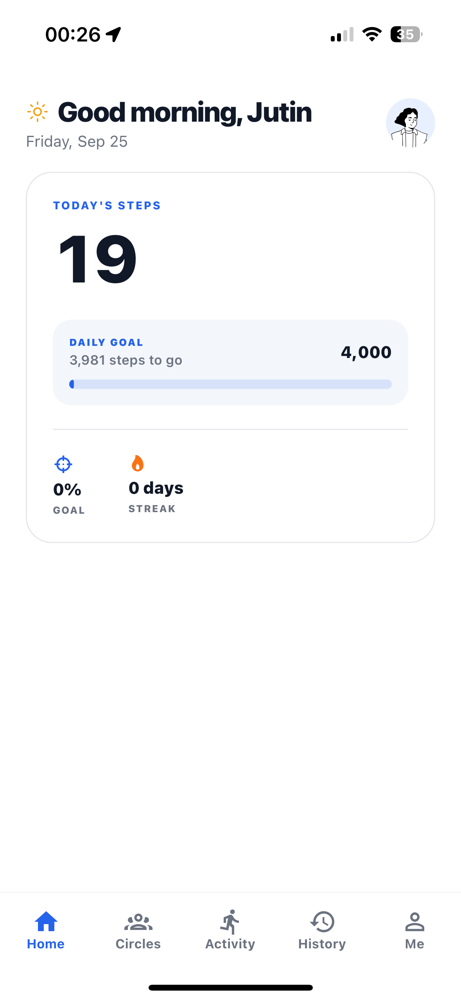
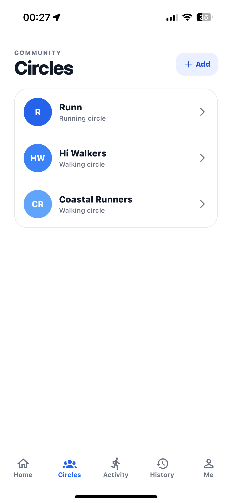
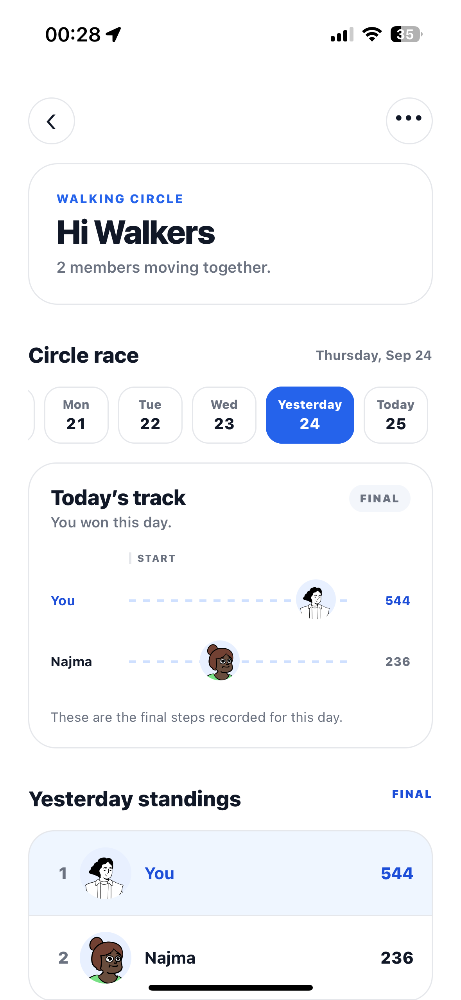
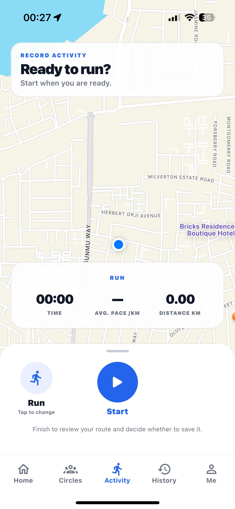
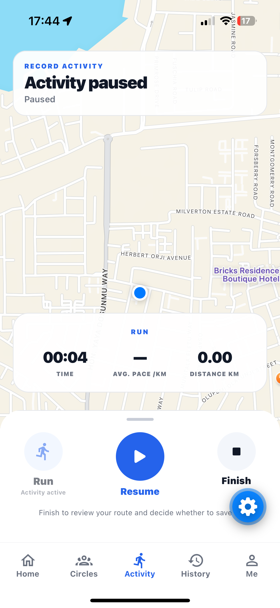
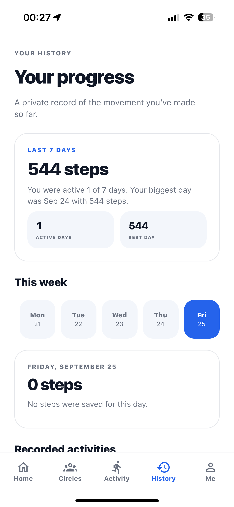
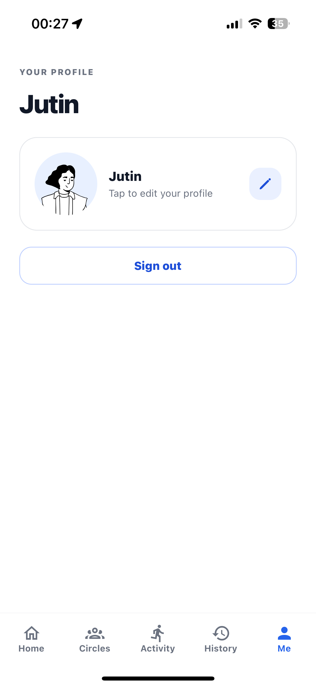
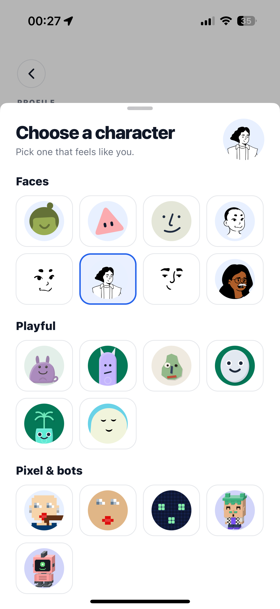

# Stride Circle

**Move together. Keep each other going.**

Stride Circle is a social fitness app for friends who want more motivation than a personal step counter can provide. It combines daily step goals with GPS-recorded walks and runs, then turns movement into a shared experience through private circles, daily standings, and a visual race track.

## The problem

Fitness trackers are useful for recording movement, but they can be solitary. Stride Circle explores a simpler social loop: make progress visible to a small group of friends, give everyone a reason to come back each day, and keep the experience encouraging rather than overwhelming.

## What I built

- Daily step tracking using the phone's built-in pedometer
- Personal daily goals, progress, streaks, and milestone celebrations
- GPS walk and run recording with live duration, distance, pace, pause/resume, and finish states
- Route previews and saved personal activity history
- Private walking and running circles that people can create or join with an invite code
- Daily circle standings and a visual race track that shows each member's live position
- Previous-day results, including the day’s winner and final standings
- Circle management: rename, member management, leave, and owner-only deletion
- Firebase email/password and Google authentication with persistent sessions
- Custom profile characters with a grouped character picker
- Skeleton loading, permission, weak-signal, empty, and error states for the key flows

## Screens

  
  
  
  

  
  
  
  

## My role

I owned the project end-to-end: product definition, feature planning, interaction design, UI implementation, mobile architecture, Firebase integration, testing, and iteration on real-device feedback.

I deliberately scoped the app as a portfolio-quality product rather than a static interface. That meant designing for actual mobile states—permissions, loading, authentication, empty circles, weak GPS signals, activity recovery, and secure shared data—not just the happy path.

## Technical choices

| Area | Choice | Why |
| --- | --- | --- |
| Mobile app | React Native, Expo, TypeScript | One codebase for iOS, Android, and web-friendly development |
| Navigation | Expo Router | File-based routing for tabs, sheets, and detail screens |
| Authentication | Firebase Authentication | Email/password and Google sign-in with persistent sessions |
| Shared data | Cloud Firestore | Real-time circle membership, shared scores, profiles, and activity data |
| Movement | Expo Sensors | Uses the phone’s built-in pedometer for daily steps |
| GPS activity | Expo Location + React Native Maps | Records walks/runs, distance, pace, and route context |
| UI | React Native StyleSheet + Expo Vector Icons | Native-feeling layout, accessible tap targets, and consistent visual language |

## Challenges I solved

### Turning private movement into a live group experience

The app separates personal movement from circle data. A member’s daily step total is synchronized into the circles they belong to, allowing each circle to render its own standings and race track without exposing a user’s entire history.

### Designing the daily race track

The race has no artificial finish line. Everyone starts at zero each day; the person with the untied highest step count holds the leader badge. At the end of the day, the standings become final and can be revisited from the circle.

### Reliable device features need honest states

GPS and pedometer features can fail or be unavailable. I added permission guidance, weak-signal messaging, pause/resume controls, recovery paths, and loading placeholders so the app communicates what is happening instead of leaving the user guessing.

### Keeping shared data secure

Firestore security rules restrict access to authenticated users and circle members. Circle owners have limited management privileges, while members can only access their own profile and membership records. Deleting a circle removes it from every member’s circle list.

### Supporting native and web development

Maps use a platform-specific implementation: native builds use the real map experience, while the web build falls back safely instead of crashing on a native-only dependency.

## Project structure

    src/
      app/          Expo Router screens and navigation
      auth/         Authentication provider and session state
      components/   Reusable UI: maps, race track, avatars, loading states
      hooks/        Firestore subscriptions and device-feature hooks
      lib/          Firebase, circles, activity, step, and avatar logic
    firebase/
      firestore.rules  Production Firestore access rules
    assets/
      screenshots/  Product screenshots used in this README

## Run locally

### Prerequisites

- Node.js (current LTS recommended)
- Expo Go or an Expo development build
- A Firebase project with Authentication and Firestore configured

### Setup

1. Clone this repository.
2. Run `npm install`.
3. Create a local `.env` file from `.env.example` and provide your own Firebase web configuration and Google OAuth client IDs.
4. Publish the rules in [firebase/firestore.rules](firebase/firestore.rules) to your Firestore database.
5. Run `npx expo start`.

For GPS and pedometer testing, use a physical device and grant the relevant permissions.

## Security and configuration

- Real environment files are ignored by Git; only [`.env.example`](.env.example) is included.
- This repository does **not** contain service-account keys, database passwords, or server-side secrets.
- Values prefixed with `EXPO_PUBLIC_` are bundled into the client app, so they must never contain private credentials.
- Review and publish [Firestore rules](firebase/firestore.rules) whenever shared-data behavior changes.

## What I learned

Stride Circle gave me hands-on experience with the difference between building a screen and building a product: designing data ownership, securing shared features, handling device permissions, responding to real-time state changes, and making mobile interactions understandable without a tutorial.

## Future directions

- Push notifications and quiet-hour preferences
- Friend reactions and lightweight encouragement
- Expanded running-circle distance challenges
- TestFlight and Android internal-distribution builds
- Privacy policy, terms, analytics, and error monitoring before a public beta

## License

This project is shared for portfolio and learning purposes. See [LICENSE](LICENSE).
