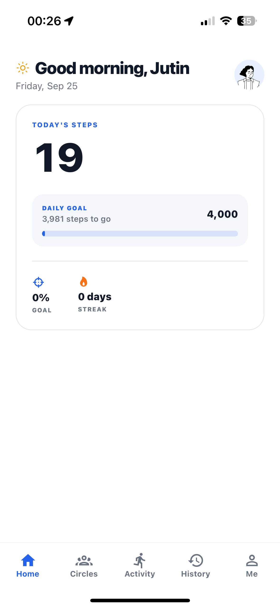
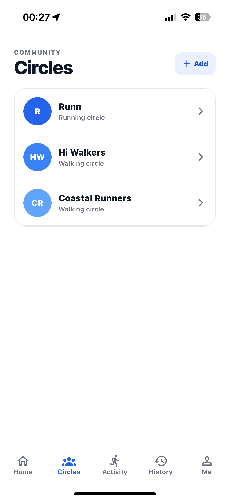
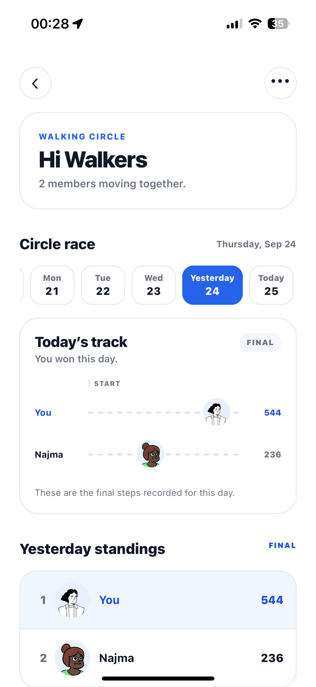
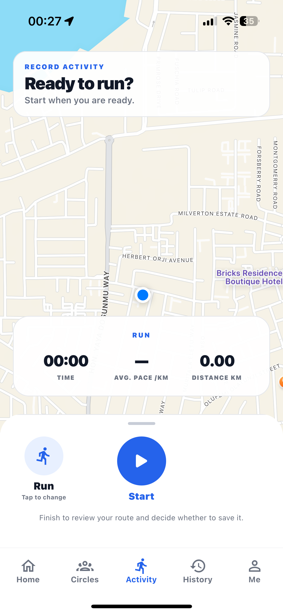
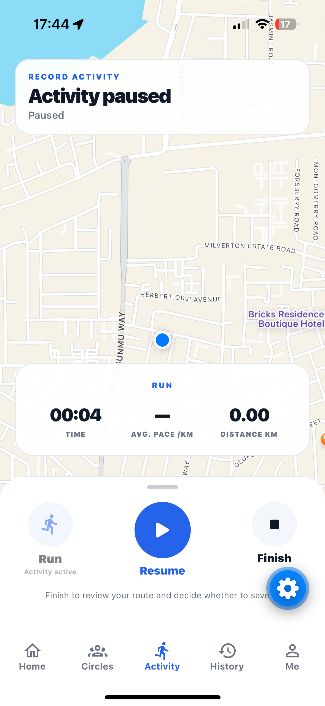
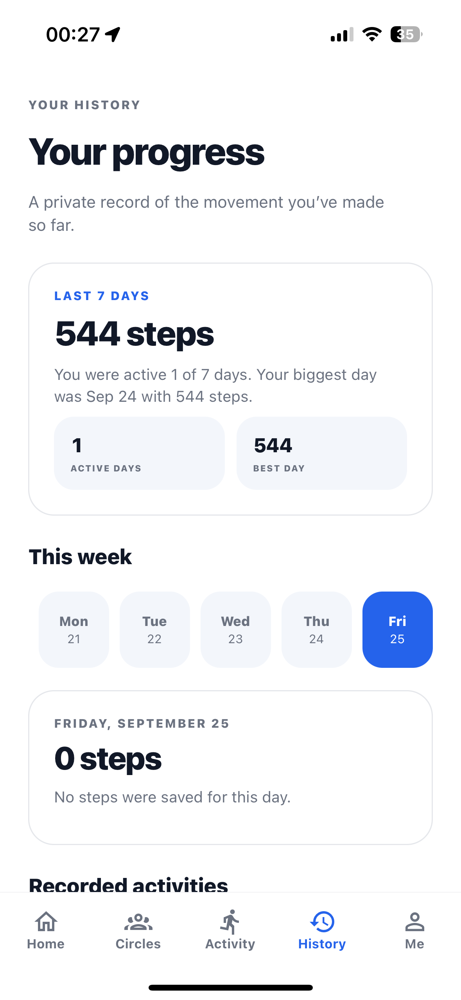
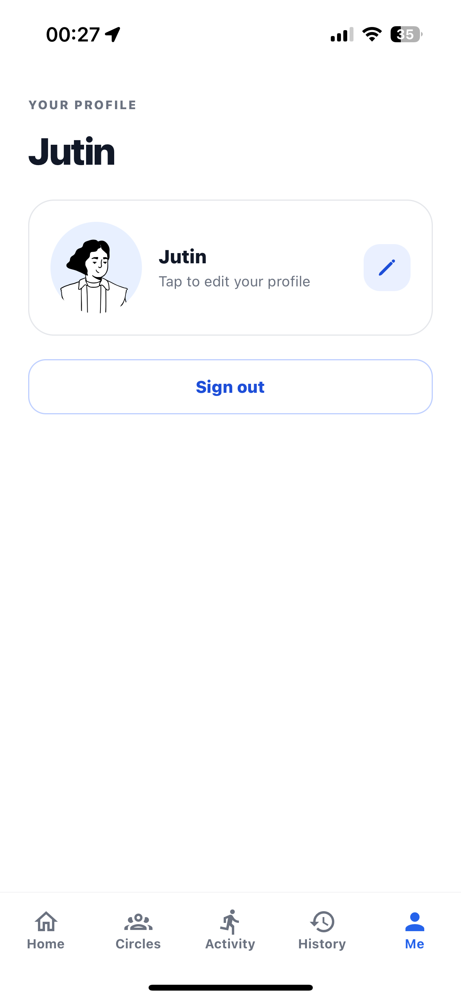
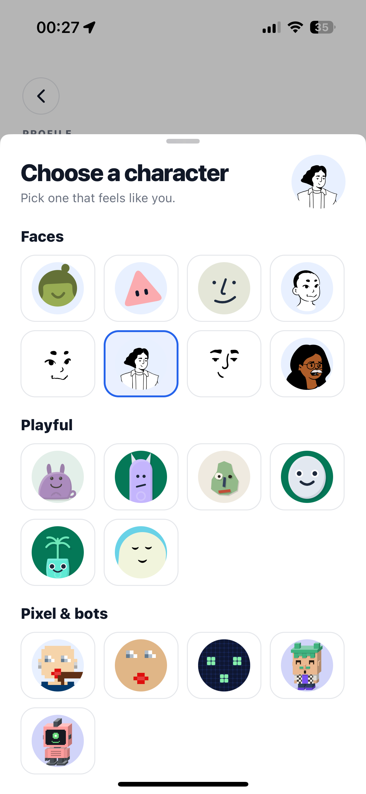

# Stride Circle

**Move together. Keep each other going.**

Stride Circle is a social walking app for people who want more motivation than a personal step counter can provide. It turns movement into a shared experience through small circles, daily and weekly standings, lightweight celebrations, and encouraging reactions.


## The problem

Fitness trackers are useful for recording movement, but they can be solitary. Stride Circle explores a simpler social loop: make progress visible to a small group of friends, give everyone a reason to come back each day, and keep the experience encouraging rather than overwhelming.

## What I built

- Daily step tracking through the configured HealthKit or Health Connect provider, with a guarded iOS Pedometer fallback for development builds
- Personal daily goals, progress, streaks, and milestone celebrations
- Public and private walking circles with a 20-member cap
- Fixed circle competition timezones so members share one daily boundary
- Broad discovery-area labels that never expose exact member locations
- A provider boundary for health-data step totals
- Optional foreground GPS walk recording; current activity UX is walking-only and legacy run records remain readable
- Daily circle standings and a visual race track that shows each member's live position
- Previous-day results and deterministic standings; server-finalized projection adoption remains incomplete
- Circle management: rename, member management, leave, and owner-only deletion
- Firebase email/password and Google authentication with persistent sessions
- Custom profile characters with a grouped character picker
- Skeleton loading, permission, weak-signal, empty, and error states for the key flows

## Screens

<p align="center">
  
  
  
  
</p>

<p align="center">
  
  
  
  
</p>

## My role

I owned the project end-to-end: product definition, feature planning, interaction design, UI implementation, mobile architecture, Firebase integration, testing, and iteration on real-device feedback.

I deliberately scoped the app as a portfolio-quality product rather than a static interface. That meant designing for actual mobile states—permissions, loading, authentication, empty circles, weak GPS signals, activity recovery, and secure shared data—not just the happy path.

## Technical choices

| Area | Choice | Why |
| --- | --- | --- |
| Mobile app | React Native, Expo, TypeScript | One codebase for iOS, Android, and web-friendly development |
| Navigation | Expo Router | File-based routing for tabs, sheets, and detail screens |
| Authentication | Firebase Authentication | Email/password and Google sign-in with persistent sessions |
| Shared data | Cloud Firestore | Real-time circle membership, shared scores, profiles, and activity data |
| Movement | Health-data provider boundary | HealthKit and Health Connect are the native launch providers; iOS Expo Pedometer remains a guarded development fallback |
| GPS activity | Expo Location + React Native Maps | Records optional walks, distance, pace, and private route context |
| UI | React Native StyleSheet + Expo Vector Icons | Native-feeling layout, accessible tap targets, and consistent visual language |

## Challenges I solved

### Turning private movement into a live group experience

The app separates personal movement from circle data. A member’s daily step total is synchronized into the circles they belong to, allowing each circle to render its own standings and race track without exposing a user’s entire history.

### Designing the daily race track

The race has no artificial finish line. Everyone starts at zero each day; the person with the untied highest step count holds the leader badge. At the end of the day, the standings become final and can be revisited from the circle.

### Reliable device features need honest states

GPS and health-data features can fail or be unavailable. I added permission guidance, weak-signal messaging, pause/resume controls, recovery paths, and loading placeholders so the app communicates what is happening instead of leaving the user guessing.

### Keeping shared data secure

Firestore security rules restrict access to authenticated users and circle members. Circle owners have limited management privileges, while members can only access their own profile and membership records. Deleting a circle removes it from every member’s circle list.

### Supporting native and web development

Maps use a platform-specific implementation: native builds use the real map experience, while the web build falls back safely instead of crashing on a native-only dependency.

## Project structure

    src/
      app/          Expo Router screens and navigation
      components/   Reusable UI and feedback states
      domain/       Pure scoring, dates, ranking, and validation rules
      services/     Health-data, permissions, analytics, and monitoring boundaries
      hooks/        Screen-facing state coordination
      lib/          Transitional Firebase repositories and shared utilities
    design-system/ Brand tokens, type scale, spacing, motion, and semantic roles
    components/ui/ Reusable accessible UI primitives for the redesign
    docs/            Canonical scope, architecture, data model, decisions, and test matrix
    firebase/        Firestore rules and indexes
    assets/
      screenshots/  Product screenshots used in this README

## Run locally

### Prerequisites

- Node.js (current LTS recommended)
- Java 21+ for Firebase Emulator Suite tests; the local wrapper uses `.tools/jdk-21*` when available
- Expo Go for UI-only work; use an Expo development build for health-data/native work
- A Firebase project with Authentication and Firestore configured

### Setup

1. Clone this repository.
2. Run `npm ci`.
3. Create a local `.env` file from `.env.example` and provide your own Firebase web configuration and Google OAuth client IDs.
4. Use `npm run emulators:test` to start the local Auth/Firestore emulators and run the Security Rules suite. The repository uses the ignored portable JDK in `.tools` when available.
5. Run `npm run typecheck`, `npm run lint`, `npm test`, and `npm run test:rn`. Firestore Rules tests use `npm run emulators:test`.
6. Use `firebase emulators:start` for interactive local Auth/Firestore work, or publish the rules in [firebase/firestore.rules](firebase/firestore.rules) to the intended Firebase project.
7. Run `npx expo start`.

For GPS and pedometer testing, use a physical device and grant the relevant permissions.
Before an EAS development, preview, or production build, configure registered `ios.bundleIdentifier` and `android.package` values in the app config. Native health modules do not run in Expo Go.

## Standalone iPhone builds

This project includes a no-paid-developer-account workflow for personal iPhone testing. The root workflow [iOS unsigned IPA](../../../.github/workflows/ios-unsigned-ipa.yml) runs on a GitHub-hosted macOS runner, generates the native iOS project from Expo configuration, builds a device app without Apple signing credentials, and uploads an IPA artifact. Import that IPA into SideStore, which signs it with the Apple Account on the iPhone. Set the app's public Firebase and Google OAuth configuration in GitHub Actions variables or secrets before the first build; the exact names are listed in [SIDESTORE.md](SIDESTORE.md).

Follow [SIDESTORE.md](SIDESTORE.md) for first-time setup, installation, updates, the seven-day free-account limits, and the current iOS capability constraints.

## Automated verification

From the repository root, enter the app directory and install the locked dependencies
with Node.js 24 and npm:

```sh
cd projects/02-friends-step-challenge/app
npm ci
npm run verify
```

`verify` runs ESLint followed by TypeScript checking and exits with a failure if
either check fails. These static checks do not need Firebase credentials or a
running app. They do not replace unit tests, Firestore-rule tests, or physical-device
checks for permissions, GPS, and step tracking.

The root workflow [App verification](../../../.github/workflows/verify.yml) runs
the same command on pull requests, pushes to `main`, and manual dispatch. It uses
read-only repository permissions, caches npm downloads, and cancels superseded
runs. No deployment or database changes happen in this workflow.

The workflow only becomes available on GitHub after it is pushed. Once it has
run successfully, configure branch protection to require the `Lint and TypeScript`
check before merging. Adding this workflow does not enable branch protection or
automatic merging.

## Security and configuration

- Real environment files are ignored by Git; only [`.env.example`](.env.example) is included.
- This repository does **not** contain service-account keys, database passwords, or server-side secrets.
- Values prefixed with `EXPO_PUBLIC_` are bundled into the client app, so they must never contain private credentials.
- Review and publish [Firestore rules](firebase/firestore.rules) whenever shared-data behavior changes.
- Direct client circle mutations are transitional. Initial Cloud Functions 2nd gen callables and scheduled projections exist, but the mobile app has not yet moved all circle and moderation mutations behind them.
- Read [docs/CURRENT_STATE.md](docs/CURRENT_STATE.md) for the implementation snapshot and [docs/FEATURE_MAP.md](docs/FEATURE_MAP.md) for route and feature status. These documents distinguish implemented behavior from planned architecture.
- The visual implementation contract lives in [docs/DESIGN_SYSTEM.md](docs/DESIGN_SYSTEM.md), with reusable primitives in `src/components/ui`.
- The walking-only History redesign, reference mapping, data limits, and test preview are documented in [docs/HISTORY_DESIGN_IMPLEMENTATION.md](docs/HISTORY_DESIGN_IMPLEMENTATION.md).

## What I learned

Stride Circle gave me hands-on experience with the difference between building a screen and building a product: designing data ownership, securing shared features, handling device permissions, responding to real-time state changes, and making mobile interactions understandable without a tutorial.

## Remaining launch work

- Move remaining circle and moderation mutations behind Cloud Functions and connect server-generated projections to the app
- Complete reporting, blocking, moderator, privacy, account-deletion, notification, analytics, and monitoring work
- Validate HealthKit and Health Connect permissions, background behavior, restart recovery, timezones, and release builds on physical devices
- Complete TestFlight and Android internal-distribution validation
- Global leaderboard, GPS group activities, and advanced challenges in later editions

## License

This project is shared for portfolio and learning purposes. See [LICENSE](LICENSE).
